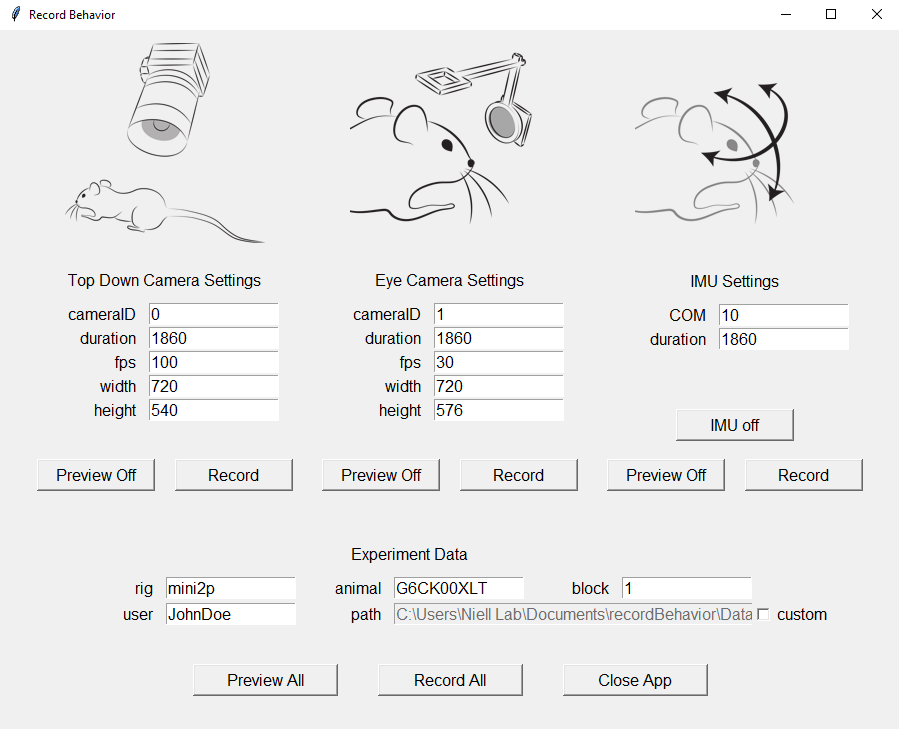

# Record Behavior

GUI for recording behavior in freely moving experiments for mice.  
Currently under development in the [Niell Lab](https://nielllab.uoregon.edu/).

# Installation

## Requirements

1. Operating System: Windows.
2. [Anaconda](https://www.anaconda.com/). Set up its path to [environment variable](https://www.youtube.com/watch?v=Xa6m1hJHba0&ab_channel=DavidRajMicheal).
3. [Git](https://git-scm.com/downloads).
4. [Microsoft Visual C++ 14.0](https://visualstudio.microsoft.com/visual-cpp-build-tools/) or greater.
5. [Arduino IDE](https://www.arduino.cc/en/software/).
6. [StreamCatcherPro](https://www.startech.com/en-us/audio-video-products/usb3hdcap).

## Step by step

In the Command Prompt:
1. Create your environment. Example:  
``conda create -n recordBehavior python=3.12.7 pip``
2. Activate your environment:  
``conda activate recordBehavior``
3. Choose a location where you would like to copy this repo. Example:  
``mkdir Documents\recordBehavior\Application``  
``cd Documents\recordBehavior\Application\``
4. Clone this repository:  
``git clone https://github.com/luismfranco/recordBehavior.git .``
5. Before installing dependencies, you might need to upgrade pip:  
``python -m pip install --upgrade pip``
6. Install dependencies in your environment:  
``pip install .``

If everything went well, you should be able to run the GUI:  
``python recordBehavior.py``

This app was built to control three components: 1) a Top Down Camera, used for recording mouse traversals during an experiment, 2) an Eye Camera, for recording pupil movements, and 3) an Inertial Measurement Unit, or IMU, that measures head movements. Therefore, this app requires connection to external components, such as 1) an [Imaging Source camera](https://www.theimagingsource.com/en-us/product/industrial/37u/), 2) a [Mini Analog Camera](https://www.aliexpress.us/item/2251832844016467.html?spm=a2g0o.productlist.main.3.319b9VGy9VGy6F&algo_pvid=1a689f69-4a2c-4fad-bfcc-4226597ac304&algo_exp_id=1a689f69-4a2c-4fad-bfcc-4226597ac304-2&pdp_ext_f=%7B%22order%22%3A%22155%22%2C%22eval%22%3A%221%22%2C%22fromPage%22%3A%22search%22%7D&pdp_npi=6%40dis%21USD%2137.99%2137.49%21%21%2137.99%2137.49%21%4021030a6217770712820173164e4a30%2112000032376155040%21sea%21US%210%21ABX%211%210%21n_tag%3A-29910%3Bd%3A32190305%3Bm03_new_user%3A-29895%3BpisId%3A5000000204886261&curPageLogUid=U0a4oN5HIhEF&utparam-url=scene%3Asearch%7Cquery_from%3A%7Cx_object_id%3A33030331219%7C_p_origin_prod%3A) connected to a [Capture Device](https://www.startech.com/en-us/audio-video-products/usb3hdcap), and 3) a [Teensy 4.0](https://www.pjrc.com/store/teensy40.html) board in order to work.

# Configuration Settings

Before running your first experiment, make sure you:
1) Have install the appropriate drivers for your [Top Down Camera](https://www.theimagingsource.com/en-us/support/download/), and for your [Eye Camera](https://www.startech.com/en-us/audio-video-products/usb3hdcap).
2) Have uploaded the [teensyIMU](https://github.com/luismfranco/recordBehavior/blob/main/src/teensyIMU/teensyIMU.ino) sketch into your Teensy board.

Also, ensure camera IDs and serial ports are properly [configured](config/package.json):
1. Under ``topDownCamera``, select the correct ``cameraID`` for connecting to the Imaging Source camera.
2. Under ``eyeCamera``, select the correct ``cameraID`` for connecting to the StarTech USB 3.0 HD Video Capture Device.
3. Under ``IMU``, select the correct ``comID`` for communication between the computer and Teensy (e.g. ***3***).

# How to Run this App

In the Command Prompt, activate your environment. Example:  
``conda activate recordBehavior``  
Then, cd to the location where this app was installed, and then type:  
``python recordBehavior.py``

You could also create a batch file. Example:  
``call activate recordBehavior``  
``cd C:\Users\Niell Lab\Documents\recordBehavior\Application\``  
``python recordBehavior.py``  

# How to Run an Experiment

In this app, you can choose to see a preview for each device independently, such as the live feed from the cameras or the serial output from the IMU, and also record data from each device independently:
https://github.com/user-attachments/assets/3eae88eb-59d0-4bd3-a1aa-3b656053a862

Alternatively, you can trigger all of the devices together, either to see a preview or to record data from all devices simultaneously:
https://github.com/user-attachments/assets/29d9639d-54ae-4646-bb5f-629324a58320
